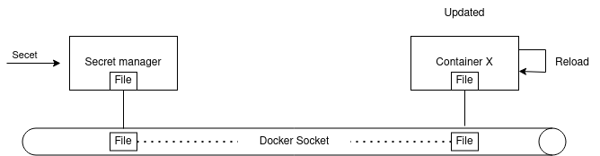

# Intro

Run on files event a deploy to target container. You can automate any config script and provide them with encrypted secret directly on a target.

## 1. Data flow representation

### 1.1 Classic diagram flow



### 1.2 Time-Dependent Representation

<br><br>


## 2 How to install

[Docker repo](https://hub.docker.com/r/maissacrement/secret-manager)

registry: maissacrement/secret-manager

## Example

This is an example configuration that should cover most relevant aspects of the new YAML configuration format.

A template need be provide on: `/etc/template.watcher.yml`
```yaml
config:
  # Create group to manage incrond Event Symbols
  - group_name: 'updatehook' # Event group name
    mode: 'IN_CREATE,IN_MOVED_TO' # Events list

watchers:
  # List of watcher
  - name: 'Provide container1' # Rules name
    file_to_watch: /home/loader/container1 # File to observe
    group: updateonly # Attach Event group name
    container: 
      name: '8e5d2676fdb0' # Container name
      path: /etc/ # Container destination path
```